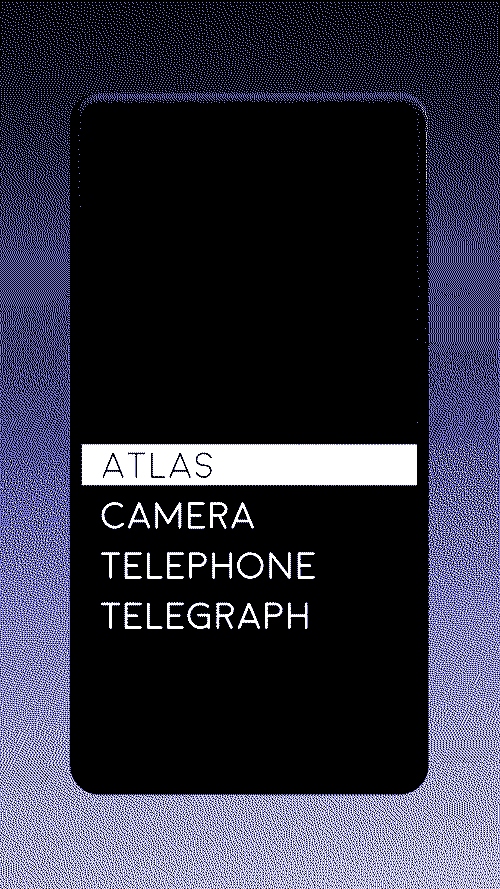

# forte 🁣
the android launcher that makes your smartphone dumber.  
[now available on google play](https://play.google.com/store/apps/details?id=hunterirving.forte)
  

### a cure for what ails you
ditch your cluttered home screen. keep the necessities.

### robust and elegant
swipe to select one of four built-in applications.

### a surge of deep satisfaction
re-imagine your phone as a tool. rediscover freedom of the mind.

### what's in the box:
• ATLAS, a map of the entire planet (pocket version)  
• CAMERA, a tool for capturing memories (now in color!)  
• TELEPHONE, which converts audible vibrations into radio waves, enabling brain-to-brain psychic communication with anyone in the world  
• TELEGRAPH, the same thing but you use your thumbs  

### optional accessories (not included):
• daily planner/sketchbook  
• bedside alarm clock  
• walkman/mp3 player  
• pocket calculator  
• gameboy  

### dmbarrad's input: 
Very cool stuff from hunter, I've never did anything related to android apps, so this cost me one night to compile.

### what I did?
I tried this
`sudo apt install openjdk-11-jdk`  
`downloaded https://developer.android.com/studio#downloads`  
`mkdir -p ~/Android/Sdk/cmdline-tools`  
moved all bin/ from studio.tar.gz to cmdline-tools above  
clicked on the studio binary, followed instructions until it downloaded all needed things.  
open terminal in forte's directory  
`chmod +x ./gradlew`  
`./gradlew clean`  
`./gradlew --refresh-dependencies`  
`./gradlew assembleDebug`  
The apk is going to be in ./app/build/outputs/apk/debug as app-debug.apk  

result:

web site  
[http://www.hunterirving.com/forte](hunterirving.com/forte)

🗺️📷☎📃

